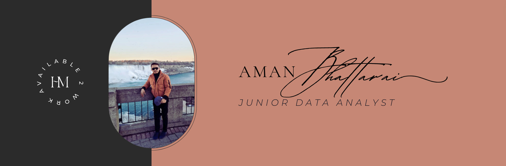

# Hi there 

Thank you 🙏 for visiting my profile !! 

- 🔭 I’m currently looking for Data Analyst jobs.
- 👷 ~~I’m building my personal portfolio (will be live soon).~~ Live at, [https://amanbhattarai.com.np](https://amanbhattarai.com.np)
- 🎓 I’m learning SQL and Tableau.

 

### 💻 Tech Stack:   
   

              

 

  
  

 

   
### 🏆 GitHub Trophies
   

 
   

---

### 💰 You can help me by Donating
  

  
<!-- Custom components by https://gprm.itsvg.in  -->
<!-- Github Trophies by https://github.com/ryo-ma/github-profile-trophy  -->
<!-- Github Readme Stats by https://github.com/anuraghazra/github-readme-stats  -->
