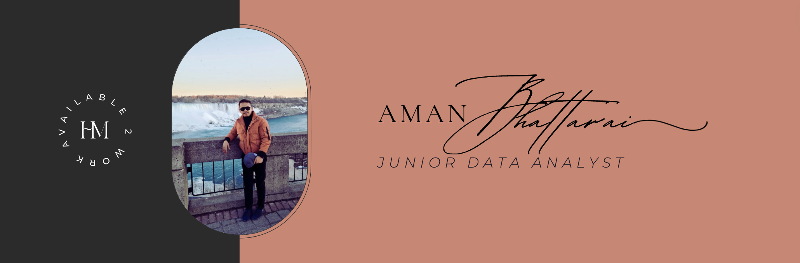

# Hi there 

Thanks for visiting my profile! I'm a **Senior Data Engineer** with 6+ years of experience building scalable data platforms across **agriculture, logistics, healthcare, and financial services**.

## 🚀 What I Do
- 🏗️ Design and build cloud-native data platforms on **Azure** and **AWS**
- ⚡ Develop high-performance ETL/ELT pipelines using **Spark**, **Databricks**, and **Snowflake**
- 🎯 Implement modern data lakehouse architectures with **Delta Lake** and **Medallion design**
- 📊 Create dimensional data models and analytics solutions for business intelligence
- 🔒 Build data governance frameworks with **Unity Catalog** and quality validation systems

## 🔭 Current Focus
- Building scalable data solutions at **Bayer Canada** using **Azure Databricks** and **Delta Lake**
- Optimizing agricultural data pipelines for crop research and commercial analytics
- Contributing to open-source data engineering projects
- Sharing knowledge through technical blogs and tutorials

 

### 💻 Tech Stack:   
 

**Cloud Platforms**  
  

**Big Data & Processing**  
   

**Data Warehousing**  
  

**Programming Languages**  
  

**Data Engineering Tools**  
  

**Databases**  
  

**DevOps & Version Control**  
   

**Data Visualization**  
 

 

<!--
## 📊 GitHub Stats

  

 
-->

<!--
## 🏆 Featured Projects

### 🌾 Agricultural Data Platform (Databricks + Delta Lake)
Enterprise-scale data lakehouse for crop trial analytics using Azure Databricks, Delta Lake, and medallion architecture. Processes 2M+ daily data points with 99.5% SLA.
- **Tech**: Azure Databricks, Delta Lake, PySpark, Unity Catalog
- **Impact**: 35% pipeline runtime reduction, 25% storage cost savings

### 📦 Multi-Tenant Freight Audit System
SaaS data platform for logistics analytics supporting 20+ enterprise clients with 10M+ monthly transactions.
- **Tech**: Snowflake, Azure Synapse, PySpark, Azure Data Factory
- **Impact**: 30% performance improvement, 40% cloud cost reduction

### 💰 Financial Data Integration Pipeline
Real-time trading and risk data processing system for asset management operations.
- **Tech**: AWS EMR, Spark, Redshift, Airflow
- **Impact**: 40% processing time reduction, regulatory compliance (SEC, FINRA)

-->
 

<!-- BLOG-POST-LIST:START 
## 📝 Latest Blog Posts

# - [Building Scalable Data Lakehouses with Delta Lake and Databricks](#)
# - [Optimizing PySpark Jobs: Performance Tuning Best Practices](#)
# - [Medallion Architecture: A Modern Approach to Data Lakes](#)
# - [Multi-Tenant Data Architecture in Snowflake](#)
# <!-- BLOG-POST-LIST:END -->

 

## 📫 Let's Connect!
- 💼 LinkedIn: [linkedin.com/in/amanbhattarai](https://linkedin.com/in/amanbhattarai)
- 📧 Email: jobsamanbhattarai@gmail.com
- 🌐 Portfolio: [amanbhattarai.com.np](https://amanbhattarai.com.np)

---

### 💰 You can help me by Donating
  

⭐️ **Open to collaborating on data engineering projects and contributing to open-source!**

<!-- Custom components by https://gprm.itsvg.in  -->
<!-- Github Trophies by https://github.com/ryo-ma/github-profile-trophy  -->
<!-- Github Readme Stats by https://github.com/anuraghazra/github-readme-stats  --
